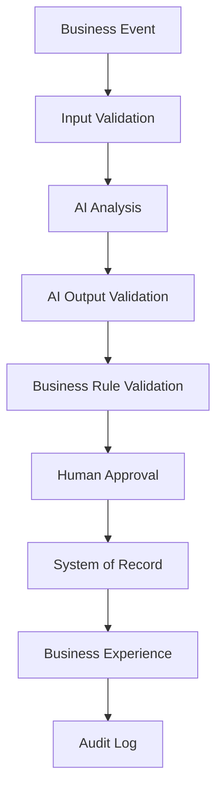

# Enterprise AI Workflow Architecture Standard

**Document Type:** Universal Architectural Standard  
**Purpose:** A reusable architectural standard for Enterprise AI projects  
**Status:** Active Standard

> This document provides architectural guidance. It does not make claims about the capabilities of any specific AI tool.

---

## 1. Constitution

Enterprise AI systems are **business systems first** and **AI systems second**.

Every workflow should prioritize:

- Business value
- Data quality
- Governance
- Explainability
- Human accountability
- Auditability

Automation is not the primary objective.

AI supports business decisions. Humans remain accountable for those decisions.

---

## 2. Standard Workflow Pattern

The standard workflow sequence is:

1. Business Event
2. Input Validation
3. AI Analysis
4. AI Output Validation
5. Business Rule Validation
6. Human Approval
7. System of Record
8. Business Experience
9. Audit Log

---

## 3. Architectural Principles

All Enterprise AI projects should follow these principles:

1. Business architecture before technology
2. Human-in-the-Loop
3. Validation First
4. Explainable AI
5. Data Quality
6. Governance
7. Security
8. Auditability
9. Traceability
10. Maintainability
11. Scalability
12. Modularity
13. Reusability
14. Cost Awareness
15. Configuration over Hard Coding
16. Documentation as Code

---

## 4. Workflow Stage Responsibilities

### 4.1 Business Event

A Business Event is the trigger that starts the workflow.

Examples include:

- Email
- API request
- Webhook
- RSS feed
- Form submission
- Database change
- Manual input
- File upload

The triggering event should be identifiable and traceable.

### 4.2 Input Validation

Validate inputs before sending them to an AI system.

Validation may include:

- Required fields
- Data types
- Dates
- URLs
- Duplicate records
- Business constraints
- Data-quality requirements

Invalid records should not continue through the standard workflow.

When appropriate, invalid records should be quarantined for review and correction.

### 4.3 AI Analysis

Run AI analysis only on validated input.

Depending on the business purpose, AI may:

- Summarize
- Classify
- Extract information
- Score
- Recommend
- Explain
- Prioritize

AI-generated results should not automatically be treated as verified facts or approved business decisions.

### 4.4 AI Output Validation

Validate AI-generated output before using it in downstream business processes.

Validation may include:

- Output schema
- Required fields
- Confidence information, when available
- Allowed values
- Score ranges
- Completeness
- Parsing success

Outputs that fail validation should be rejected, corrected, retried, quarantined, or escalated according to the workflow design.

### 4.5 Business Rule Validation

Apply deterministic business rules after validating the AI output.

Business rules override AI output.

Examples may include:

- Approval thresholds
- Eligibility requirements
- Risk limits
- Routing requirements
- Regulatory constraints
- Data-retention requirements

An AI recommendation must not bypass an established business rule.

### 4.6 Human Approval

Authorized human reviewers may:

- Approve
- Reject
- Revise
- Escalate

Humans remain accountable for business decisions.

The workflow should clearly identify:

- Who reviews the output
- What the reviewer evaluates
- When approval is required
- What happens after rejection
- When escalation is required

### 4.7 System of Record

Persist only validated and approved data in the designated System of Record.

The workflow should identify:

- The authoritative data destination
- Required fields
- Record ownership
- Update rules
- Version or status information
- Applicable retention requirements

Unvalidated or unapproved AI output should not silently become an official business record.

### 4.8 Business Experience

Expose approved information through the appropriate business interface.

Examples include:

- Dashboards
- APIs
- Notifications
- Reports
- Business applications
- Other approved interfaces

The interface should present information in a way that supports the intended business action or decision.

### 4.9 Audit Log

Record significant workflow activity.

The audit log may include:

- Workflow execution
- Input-validation results
- AI requests and responses
- AI output-validation results
- Business-rule decisions
- Human approvals, rejections, revisions, and escalations
- System-of-record writes
- Notifications
- Errors and exceptions

Audit information should support traceability, troubleshooting, governance, and review.

---

## 5. Documentation Standard

The following documentation should remain consistent with this architectural standard:

- Architecture diagrams
- Workflow diagrams
- README files
- Technical documentation
- Standard Operating Procedures
- Design specifications
- Portfolio project documentation

Any justified exception to this standard should be documented.

An exception record should explain:

- The standard being modified or omitted
- The reason for the exception
- The risks introduced
- The controls used to manage those risks
- The person or role responsible for approval

---

## 6. Review Perspectives

Enterprise AI solutions should be reviewed from the following perspectives:

| Perspective | Primary Review Focus |
|---|---|
| Business Systems Analyst | Business objective, requirements, stakeholders, rules, and process fit |
| Enterprise Architect | Architecture alignment, integration, scalability, and maintainability |
| AI Workflow Engineer | AI workflow design, validation, orchestration, and failure handling |
| Data Quality Engineer | Data completeness, validity, consistency, accuracy, and exception handling |
| Security Architect | Access control, privacy, security risks, and protection of sensitive information |
| Technical Writer | Clarity, consistency, usability, and documentation quality |
| UX Designer | Human interaction, usability, decision support, and accessibility |
| Hiring Manager | Business relevance, professional quality, demonstrated skills, and explainability |

---

## 7. Long-Term Objective

The long-term objective is to create reusable:

- Architectures
- Components
- Templates
- Prompts
- Workflows
- Validation rules
- Documentation
- Design systems
- Knowledge assets

These assets should support the continuous development of safe, governed, explainable, maintainable, and reusable Enterprise AI systems.

---

## 8. Standard Application Rule

This standard should be considered when designing or reviewing:

- Enterprise AI workflows
- AI-assisted business processes
- Automation projects
- AI agents
- System integrations
- Data pipelines
- Decision-support systems
- Knowledge-management systems
- Portfolio projects
- Future Enterprise AI Workbench capabilities

Project-specific requirements may extend this standard.

They should not weaken its core requirements without a documented and approved exception.

---

## 9. Relationship to Other Project Documents

This document defines the reusable architectural standard for Enterprise AI workflows.

It should be used together with:

- `Enterprise_AI_Workbench_Constitution.md`
- `Governance.md`
- `Project_Charter.md`
- Relevant architecture decision records
- Relevant methodology documents
- Relevant validation and review checklists

If a conflict is identified, it should be documented and resolved through the project's governance and decision-record process.

---

## 10. Source-of-Truth Rule

The Markdown version of this document is the maintained source of truth for GitHub and ongoing project development.

The original Word document may be retained as a source document or historical reference.

To prevent conflicting versions:

- Make future content changes in the Markdown version.
- Use Git history to track changes.
- Update the document status when formally revised.
- Record material architectural changes in the appropriate decision record or change log.
