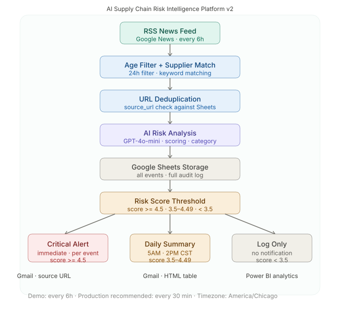

# AI Supply Chain Risk Intelligence Platform v2


[](https://gamma.app/docs/AI-Supply-Chain-Risk-Intelligence-Platform-v2-mes7lpn3hd76t6b)
[](https://kk-2050.github.io/ai-supply-chain-risk-platform-v2/)

An end-to-end AI-powered supply chain risk monitoring and alerting platform. Automatically detects, analyzes, scores, and routes supply chain risk events from live RSS news feeds — designed as an **operational decision-support system**, not just a technical automation demo.

> *"The system separates event persistence, dashboard visibility, and human notification. All events are logged. Dashboards remain available for self-service monitoring. Only critical or summarized risks are pushed to users."*
>
> **Designed for enterprise-grade reliability — not just automation.**

---

## Live Demo

Dashboard:
https://kk-2050.github.io/ai-supply-chain-risk-platform-v2/

---

## Presentation

Gamma Presentation:
[https://your-gamma-link](https://gamma.app/docs/AI-Supply-Chain-Risk-Intelligence-Platform-v2-mes7lpn3hd76t6b)

---

## Architecture Overview



---

## Key Features

- AI-powered risk analysis using GPT-4o-mini
- Automated Critical Alert emails with source article evidence
- URL-based deduplication — no repeated processing
- Weighted Business Risk Score engine
- Twice-daily Operational Summary workflow (5AM / 2PM CST)
- Category standardization (9 standard risk categories)
- Status tracking for audit and compliance
- Enterprise-ready workflow design with human-in-the-loop governance

---

## Business Value

- Reduces manual monitoring effort for supply chain risk
- Improves escalation visibility across operations and procurement teams
- Helps procurement and operations teams prioritize risks
- Reduces alert fatigue through score-based routing
- Creates centralized operational intelligence with full audit trail
- Supports executive decision-making with evidence-based alerts

---

## What It Does

- Fetches live supply chain news every 6 hours from Google News RSS
- Filters out articles older than 24 hours (age filter)
- Deduplicates articles using URL-based deduplication
- Matches news to fictional supplier profiles using keyword matching
- Analyzes each event with AI (GPT-4o-mini) to extract risk category, severity, operational impact, urgency, and recommended action
- Calculates a composite Business Risk Score using a weighted formula
- Routes events by score: Critical Alert (immediate) or Daily Summary (twice daily)
- Sends professional HTML emails with source article evidence links
- Tracks alert status back to Google Sheets for audit and analytics

---

## System Architecture

```
RSS News Feed (Google News)
    ↓
Age Filter (24 hours)
    ↓
URL Deduplication (source_url check)
    ↓
Supplier Keyword Matching
    ↓
AI Risk Analysis (GPT-4o-mini)
    ↓
Category Standardization (9 standard categories)
    ↓
Google Sheets Storage (all events — full audit log)
    ↓
Risk Score Threshold Check
    ↓
Score >= 4.5   → Critical Alert Email (immediate, per event, with source URL)
Score 3.5–4.49 → Daily Summary Email (5:00 AM and 2:00 PM CST)
Score < 3.5    → Log Only (no notification)
```

---

## Business Risk Score Formula

```
Overall Risk Score = (Severity × 0.40) + (Operational Impact × 0.35) + (Urgency × 0.25)
```

| Dimension | Weight | Rationale |
|-----------|--------|-----------|
| Severity | 40% | Potential magnitude of harm drives the most critical business decisions |
| Operational Impact | 35% | Direct disruption to production, logistics, and procurement |
| Urgency | 25% | Time sensitivity — urgency alone does not justify alert fatigue |

---

## Alert Routing

| Score | Alert Level | Action |
|-------|-------------|--------|
| >= 4.5 | CRITICAL | Immediate email per event with source article link |
| 3.5 – 4.49 | SUMMARY | Included in next Daily Summary email |
| < 3.5 | LOW | Logged only — no notification |

---

## Workflows

### Critical Alert Workflow
- Scheduled: every 6 hours (demo) — production recommended: every 30 minutes
- Fetches RSS → age filter → deduplication → AI analysis → Google Sheets → threshold check → email

### Operational Summary Workflow
- Scheduled: 5:00 AM and 2:00 PM CST (covers all US time zones)
- Reads Google Sheets → filters summary-level pending events → AI executive summary → HTML email

---

## Tech Stack

| Component | Technology |
|-----------|-----------|
| Workflow Automation | n8n Cloud |
| AI Analysis | OpenAI GPT-4o-mini |
| Data Storage | Google Sheets |
| Email Notifications | Gmail (via n8n) |
| Dashboard Prototype | GitHub Pages (HTML) |
| Enterprise Analytics (planned) | Power BI |
| SQL Logging (planned) | SQL Server Express |

---

## Dashboard Prototype

A lightweight HTML dashboard prototype is included to demonstrate how operational risk data could be visualized.

Future production implementation is planned using Power BI with:
- Real-time risk monitoring
- Supplier trend analysis
- Executive KPIs
- Operational drill-down reporting

---

## Risk Categories (Standardized)

`Geopolitical` `Logistics` `Supply Shortage` `Financial` `Tariff` `Cybersecurity` `Natural Disaster` `Operational Disruption` `Other`

---

## Fictional Suppliers (Demo Disclaimer)

| ID | Supplier | Industry |
|----|---------|----------|
| 1 | Apex Components Ltd | Electronic Components |
| 2 | Nova Auto Parts Co | Automotive |
| 3 | BioSource Materials | Pharmaceutical / Chemical |
| 4 | ChipTech Global | Semiconductor |
| 5 | FastRoute Logistics | Logistics / Freight |

> **Disclaimer:** All supplier names are fictional and created for portfolio demonstration purposes only. Any resemblance to real companies is coincidental.

---

## Why AI Was Used

Traditional keyword-based alerting cannot easily estimate operational severity, prioritize urgency across concurrent events, summarize executive-level impact, or generate mitigation recommendations at scale. AI (GPT-4o-mini) provides contextual risk interpretation, business-oriented summarization, and scalable analysis automation.

## Why Not Fully Autonomous

The platform intentionally uses AI-assisted recommendations rather than fully autonomous decision-making. Human operational review remains important for high-impact supply chain decisions. The system routes intelligence to humans — it does not replace human judgment.

## Why n8n Was Selected

n8n provides low-code workflow orchestration with full visibility, rapid prototyping, flexible API integration, and operational transparency. Production alternatives include Azure Logic Apps, Power Automate, or enterprise orchestration platforms. The concepts demonstrated here are directly transferable.

---

## Repository Structure

```
ai-supply-chain-risk-platform-v2/
├── README.md
├── workflow-json/          n8n workflow exports (Critical Alert + Summary)
├── docs/                   Data dictionary, methodology, architecture docs
├── dashboard/              GitHub Pages HTML prototype dashboard
├── screenshots/            Email and workflow screenshots
├── sql/                    SQL Server prototype table designs
├── sample-data/            Sample risk events data
└── architecture/           System architecture diagrams
```

---

## Demo vs Production

| Aspect | Demo (Current) | Production (Recommended) |
|--------|---------------|--------------------------|
| Scheduler | Every 6 hours | Every 30 minutes |
| Storage | Google Sheets | SQL Server / Azure SQL |
| Suppliers | Fictional (hardcoded) | ERP-integrated supplier master |
| Notifications | Gmail | Teams / Slack / Enterprise email |
| Analytics | HTML prototype | Live Power BI dashboards |

---

## SQL Server Prototype

SQL Server tables were designed as a future production backend layer. The current working workflow uses Google Sheets for lightweight demo storage. SQL Server integration is planned as a future enhancement for enterprise-scale storage, audit logging, and Power BI reporting.

SQL screenshots are included in the `/sql` folder for reference.

Included SQL screenshots show the planned database structure:

- `risk_events` — Core risk event storage
- `risk_scores` — AI scoring results
- `supplier_master` — Supplier management
- `alert_logs` — Alert delivery tracking

---

## Future Roadmap

- SQL Server integration (in progress)
- Power BI real-time dashboards
- Supplier master management (Google Sheets tab)
- Teams / Slack notifications
- Predictive risk forecasting
- Human approval workflows
- Role-based alert routing

---

## Key Skills Demonstrated

- AI Workflow Automation
- n8n Orchestration
- Operational Intelligence Design
- Enterprise Systems Thinking
- Business Process Automation
- Risk Monitoring Architecture
- AI-assisted Decision Support
- Executive Reporting Automation

---

## Portfolio Positioning

This project demonstrates practical enterprise workflow automation concepts, AI-assisted operational intelligence, business process orchestration, and scalable operational monitoring design — directly aligned with roles in AI Automation Architecture, Systems Analysis, Business Process Automation, and Enterprise AI Operations.

---

*Built with n8n Cloud, OpenAI GPT-4o-mini, Google Sheets*
*All supplier data is fictional. Created for portfolio demonstration purposes only.*
