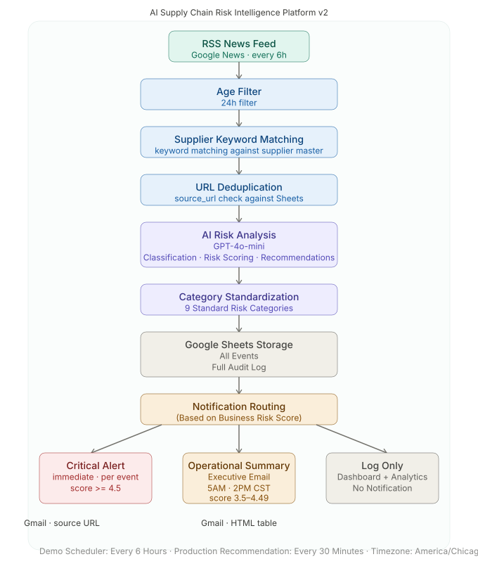

# AI Supply Chain Risk Intelligence Platform v2


[](https://gamma.app/docs/AI-Supply-Chain-Risk-Intelligence-Platform-v2-mes7lpn3hd76t6b)
[](https://kk-2050.github.io/ai-supply-chain-risk-platform-v2/)

An end-to-end AI-powered supply chain risk monitoring and alerting platform. Automatically detects, analyzes, scores, and routes supply chain risk events from live RSS news feeds — designed as an **operational decision-support system**, not just a technical automation demo.

> *"The system separates event persistence, dashboard visibility, and human notification. All events are logged. Dashboards remain available for self-service monitoring. Only critical or summarized risks are pushed to users."*
>
> **Designed for enterprise-grade reliability — not just automation.**

---

## Live Demo

Dashboard:
https://kk-2050.github.io/ai-supply-chain-risk-platform-v2/

---

## Presentation

Gamma Presentation:
[https://your-gamma-link](https://gamma.app/docs/AI-Supply-Chain-Risk-Intelligence-Platform-v2-mes7lpn3hd76t6b)

---

## Architecture Overview



> High-level solution flow. See **Enterprise Solution Architecture** below for more detail.

---

## Contents

[Key Features](#what-it-does) · [Business Value](#business-value) · [Executive Summary](#executive-summary) · [Architecture](#enterprise-solution-architecture) · [Implementation Workflow](#implementation-workflow) · [Business Risk Score](#business-risk-score-formula) · [Alert Routing](#alert-routing) · [Risk Categories](#risk-categories-standardized) · [Data Quality & Governance](#data-quality--governance) · [Tech Stack](#tech-stack) · [Dashboards](#dashboards-operational-and-executive-views) · [Presentation](#presentation) · [Demo vs Production](#demo-vs-production) · [Future Roadmap](#future-roadmap) · [Repository Structure](#repository-structure) · [Portfolio Positioning](#portfolio-positioning) · [Security & Privacy](#security--privacy-note)

---

## What It Does

- Fetches live supply chain news every 6 hours from Google News RSS
- Filters out articles older than 48 hours (age filter)
- Matches news to fictional supplier profiles using keyword matching
- Checks each article's URL against Google Sheets to skip duplicates before AI processing
- Uses AI (GPT-4o-mini) to score each new event: category, severity, operational impact, urgency, and a recommended action
- Standardizes each event into one of 9 defined risk categories
- Calculates a Business Risk Score using a weighted formula
- Stores every processed event in Google Sheets as a full audit log
- Routes events by score: Critical Alert (immediate) or Operational Summary (twice daily)
- Sends HTML emails with links to the source article as evidence
- Writes delivery status back to Google Sheets for tracking and analytics

---

## Business Value

- **Operational Intelligence** — turns raw news into structured, scored risk events tied to specific suppliers.
- **Decision Support** — AI shows severity, impact, urgency, and a recommended action for each event. People make the final decision.
- **Knowledge Preservation** — every event becomes a saved record, not a throwaway. Raw news turns into stored knowledge, which supports both compliance and future pattern review.
- **Reduced Alert Fatigue** — only high-risk events trigger an immediate alert. Everything else is summarized or logged.
- **Auditability** — every processed event is stored in Google Sheets, including events that never triggered a notification.
- **Business Visibility** — the dashboard prototype gives self-service access to the data, separate from the alert path.
- **Human Review** — Critical Alert and Operational Summary emails support human review. They do not trigger any automated action.
- **Scalability** — the scoring formula, risk categories, and alert thresholds are all configurable. The architecture is built to support a larger, production-scale database later.

---

## Executive Summary

Supply chain problems are often spotted too late. They get lost in general news feeds, or reported without enough detail to act on.

This platform continuously monitors public news sources. It scores each relevant event using a weighted business risk model. Then it sends the result to the right audience. High-severity events trigger an immediate alert. Moderate-risk events go into a regular summary. Every event — no matter the score — is saved for the record.

The goal is simple: help people spot important risks sooner while avoiding unnecessary alerts. AI classifies, scores, and summarizes each event. People make the final decision.

This project shows more than AI workflow automation. It also shows enterprise architecture, operational governance, and business systems thinking.

---

## Enterprise Solution Architecture

This platform keeps three responsibilities separate. Simpler automations often combine all three into one step:

- **Event persistence** — every event is saved to Google Sheets, no matter its score or whether anyone gets notified.
- **Dashboard visibility** — people can browse the data anytime on the dashboard, separate from the alert path. This keeps low-priority events visible without adding noise to anyone's inbox.
- **Human notification** — only events that cross a set risk threshold are emailed to people.

This separation keeps alerts meaningful. Nothing is thrown away, but not everything interrupts a person's day.

The diagram above shows the platform at a high level. It does not show every technical step. For the exact sequence, see [Implementation Workflow](#implementation-workflow). For the business-layer view, see [Conceptual Architecture](#conceptual-architecture).

### Conceptual Architecture

```
Business Experience Layer
        ↓
Workflow Automation Layer
        ↓
AI Intelligence Layer
        ↓
Data Layer
```

| Layer | Business Responsibility | Technology Component |
|---|---|---|
| **Business Experience Layer** | How people use the system: Critical Alert emails, Operational Summary emails, and a self-service dashboard | Gmail (via n8n), HTML dashboard prototype |
| **Workflow Automation Layer** | Runs the pipeline: brings in news, filters it, matches suppliers, scores risk, and routes the result | n8n Cloud — two scheduled workflows: Critical Alert (every 6 hours) and Operational Summary (5 AM / 2 PM CST) |
| **AI Intelligence Layer** | Scores each event, and writes executive summaries across events | GPT-4o-mini (per-event risk scoring), GPT-4.1-mini (executive summarization) |
| **Data Layer** | Stores every event as the audit log for this demo. Also checks for duplicates and tracks email delivery | Google Sheets |

Because the layers are separate, each one can change on its own. For example, the Data Layer could move from Google Sheets to SQL Server. Or the Business Experience Layer could move from Gmail to Teams or Slack. Neither change would require rebuilding the other layers. (See [Future Roadmap](#future-roadmap).)

---

## Implementation Workflow

This section shows the real, step-by-step sequence built in n8n. The n8n workflow files are the source of truth here. The workflow groups some business functions into shared Code nodes for maintainability — for the exact node-level mapping, see `Workflow-Implementation.md`.

<details>
<summary><strong>Critical Alert Workflow</strong></summary>

```
RSS News Feed (Google News, every 6 hours)
    ↓
Age Filter (48 hours)
    ↓
Supplier Keyword Matching
    ↓
Prepare AI Risk Prompt
    (Google Sheets lookup + URL-based deduplication check
     against existing source URLs, prior to AI processing)
    ↓
AI Risk Analysis (GPT-4o-mini)
    (category, severity, operational impact, urgency, recommendation)
    ↓
Category Standardization (9 standard categories)
    ↓
Business Risk Score calculated
    ↓
Google Sheets Storage (all events — full audit log)
    ↓
Notification Routing (based on Business Risk Score)
    ↓
Score >= 4.5     → Critical Alert email (immediate, per event, with source URL)
Score 3.5–4.49   → Queued for the next Operational Summary
Score < 3.5      → Logged only — no notification
```

URL-based deduplication is not its own step in the workflow. It happens inside the **Prepare AI Risk Prompt** step, which checks each article's source URL against existing Google Sheets records before the event goes to the AI. This stops the system from re-analyzing, or re-alerting on, an article it has already seen.

</details>

<details>
<summary><strong>Operational Summary Workflow</strong></summary>

```
Scheduled trigger: 5:00 AM and 2:00 PM CST
    ↓
Read Google Sheets
    (pending, summary-level events from the most recent 72 hours)
    ↓
AI Executive Summary (GPT-4.1-mini)
    ↓
HTML Email (Operational Summary)
    ↓
Delivery status written back to Google Sheets
```

</details>

The Critical Alert Workflow and the Operational Summary Workflow run on their own schedules. Both read from, and write to, the same Google Sheets.

---

## Business Risk Score Formula

```
Business Risk Score = (Severity × 0.40) + (Operational Impact × 0.35) + (Urgency × 0.25)
```

| Dimension | Weight | Rationale |
|-----------|--------|-----------|
| Severity | 40% | Potential magnitude of harm drives the most critical business decisions |
| Operational Impact | 35% | Direct disruption to production, logistics, and procurement |
| Urgency | 25% | How time-sensitive the event is — urgency alone should not flood people with alerts |

---

## Alert Routing

| Score | Alert Level | Action |
|-------|-------------|--------|
| >= 4.5 | CRITICAL | Immediate email per event with source article link |
| 3.5 – 4.49 | SUMMARY | Included in the next Operational Summary email |
| < 3.5 | LOW | Logged only — no notification |

---

## Risk Categories (Standardized)

`Geopolitical` `Logistics` `Supply Shortage` `Financial` `Tariff` `Cybersecurity` `Natural Disaster` `Operational Disruption` `Other`

---

## Data Quality & Governance

- **Validation** — the 48-hour age filter and supplier keyword matching remove noise before an event reaches the AI stage.
- **Deduplication** — every article's URL is checked against Google Sheets before AI processing. This stops duplicate analysis and duplicate alerts.
- **Business Rules** — the Business Risk Score formula and fixed thresholds (4.5 and 3.5) decide routing. This keeps routing consistent, instead of relying on judgment calls at run time.
- **Human Review** — AI output (category, severity, impact, urgency, recommendation) goes to people for review. The system never acts on its own output.
- **Audit Trail** — every event is stored in Google Sheets, no matter its score. Delivery status for both Critical Alert and Operational Summary emails is written back for tracking.
- **Enterprise Governance** — keeping storage, dashboard visibility, and notification separate (see [Enterprise Solution Architecture](#enterprise-solution-architecture)) means the full record stays intact, even for events that never trigger a human alert.

---

## Tech Stack

| Component | Technology | Why |
|-----------|-----------|-----|
| Workflow Automation | n8n Cloud | Low-code tool with full visibility into each step, and quick to change |
| AI Analysis (per-event scoring) | OpenAI GPT-4o-mini | Affordable model, well-suited to structured classification and scoring |
| AI Analysis (executive summary) | OpenAI GPT-4.1-mini | Good at writing narrative summaries across multiple events |
| Data Storage | Google Sheets | Simple storage with no setup required — a good fit for demo-scale audit logging |
| Email Notifications | Gmail (via n8n) | Simple, reliable delivery channel for demo-scale alerting |
| Operational Dashboard | Responsive Web (HTML), GitHub Pages | Simple, static hosting for the operational decision-support prototype |
| Executive Dashboard (planned) | Power BI | Industry-standard tool for production-scale reporting |
| SQL Logging (planned) | SQL Server Express | Production-appropriate relational database for audit-scale storage |

---

## Dashboards: Operational and Executive Views

The platform routes from one shared operational data layer into four channels. Two push notifications out; two support pull-based review. None of the four depends on another.

```
                       Shared Operational Data
                                 │
        ┌───────────────────────┼───────────────────────┬───────────────────────┐
        ▼                       ▼                       ▼                       ▼
  Critical Alert         Operational Summary      Operational Dashboard     Executive Dashboard
     (Push)                    (Push)                    (Pull)                  (Pull)
```

### Dashboard Roles

| Experience | Technology | Purpose | Primary Users |
|---|---|---|---|
| Operational Dashboard | Responsive Web (HTML) | Event-level monitoring, AI-assisted decision support, evidence review, and human follow-up | Supply Chain Analysts, Procurement, Operations Managers; Directors and Executives when reviewing a specific critical event |
| Executive Dashboard | Power BI | Historical analysis, supplier and category trends, KPI reporting, and executive analytics | Directors, Executives, Leadership, and analysts performing trend analysis |

Both dashboards use the same operational data but serve different business needs. The Operational Dashboard supports event-level action and review, while the Executive Dashboard supports aggregated analysis and long-term visibility.

A lightweight HTML prototype of the Operational Dashboard is included in `dashboard/`. It surfaces the same Decision Support flow described earlier in this README — AI summary, recommended action, evidence, and review status — for individual events.

Future production implementation of the Executive Dashboard (Power BI) is planned, with:
- Real-time risk monitoring
- Supplier trend analysis
- Executive KPIs
- Operational drill-down reporting

---

## Presentation

This repository includes presentation materials for stakeholders and reviewers:

- PowerPoint presentation
- PDF presentation
- Published Gamma presentation (see `docs/gamma/gamma-link.md`)
- Presentation documentation (`docs/gamma/README.md`)
- Presentation change history (`docs/gamma/CHANGELOG.md`)

---

## Demo vs Production

| Aspect | Demo (Current) | Production (Recommended) |
|--------|---------------|--------------------------|
| Scheduler | Every 6 hours | Every 30 minutes |
| Storage | Google Sheets | SQL Server / Azure SQL |
| Suppliers | Fictional (hardcoded) | ERP-integrated supplier master |
| Notifications | Gmail | Teams / Slack / Enterprise email |
| Analytics | HTML prototype | Live Power BI dashboards |

<details>
<summary><strong>SQL Server Prototype (planned)</strong></summary>

SQL Server tables were designed for a future production backend. Today, the working system uses Google Sheets for lightweight demo storage. SQL Server integration is planned as a future upgrade, for enterprise-scale storage, audit logging, and Power BI reporting.

SQL screenshots are included in the `/sql` folder for reference.

The included SQL screenshots show the planned database structure:

- `risk_events` — Core risk event storage
- `risk_scores` — AI scoring results
- `supplier_master` — Supplier management
- `alert_logs` — Alert delivery tracking

</details>

---

## Future Roadmap

**Next Phase**
- SQL Server integration (in progress)
- Supplier master management (Google Sheets tab)
- Power BI real-time dashboards

**Production Readiness**
- Configuration tables to externalize thresholds, scheduling, and supplier rules from workflow logic
- Retry strategy for API and integration failures
- Workflow health monitoring and alerting
- Enterprise-grade logging

**Enterprise Scale**
- Teams / Slack notifications
- Role-based alert routing
- Human approval workflows

**Future Vision**
- Predictive risk forecasting
- AI copilot for risk investigation
- Enterprise data platform integration

---

## Repository Structure

```
ai-supply-chain-risk-platform-v2/
├── README.md
├── workflow-json/          n8n workflow exports (Critical Alert + Operational Summary)
├── docs/                   Data dictionary, methodology, architecture documentation
│   └── gamma/              Presentation materials
│       ├── README.md
│       ├── AI-Supply-Chain-Risk-Intelligence-Platform-v2.pdf
│       ├── AI-Supply-Chain-Risk-Intelligence-Platform-v2.pptx
│       ├── gamma-link.md
│       └── CHANGELOG.md
├── dashboard/              GitHub Pages HTML prototype dashboard
├── screenshots/            Email and workflow screenshots
├── sql/                    SQL Server prototype table designs
├── sample-data/            Sample risk events data
└── architecture/           System architecture diagrams
```

<details>
<summary><strong>Fictional Suppliers (Demo Disclaimer)</strong></summary>

| ID | Supplier | Industry |
|----|---------|----------|
| 1 | Apex Components Ltd | Electronic Components |
| 2 | Nova Auto Parts Co | Automotive |
| 3 | BioSource Materials | Pharmaceutical / Chemical |
| 4 | ChipTech Global | Semiconductor |
| 5 | FastRoute Logistics | Logistics / Freight |

> **Disclaimer:** All supplier names are fictional and created for portfolio demonstration purposes only. Any resemblance to real companies is coincidental.

</details>

---

## Key Skills Demonstrated

- Enterprise Workflow Automation
- n8n Orchestration
- Operational Intelligence Design
- Enterprise Systems Thinking
- Business Process Automation
- Risk Monitoring Architecture
- AI-Assisted Decision Support
- Executive Reporting Automation

<details>
<summary><strong>Design Rationale — Why AI, Why Not Autonomous, Why n8n</strong></summary>

### Why AI Was Used

Simple keyword alerts cannot judge severity, weigh urgency across many events at once, write an executive summary, or suggest a fix. AI can do all of this at scale. GPT-4o-mini analyzes each event. GPT-4.1-mini writes the summaries. But AI only assists — it does not decide.

### Why Not Fully Autonomous

This platform gives AI-assisted recommendations, not fully automated decisions. High-impact supply chain choices still need human review. The system delivers information to people. It does not replace human judgment, and it does not take action on its own.

### Why n8n Was Selected

n8n is a low-code workflow tool. It gives full visibility into each step, and makes it easy to prototype and connect APIs. Production alternatives include Azure Logic Apps, Power Automate, or other enterprise orchestration tools. The concepts in this project carry over directly to any of them.

</details>

---

## Portfolio Positioning

This project shows practical enterprise workflow automation, AI-assisted operational intelligence, and business process orchestration. It also shows a systems-analysis habit: documenting the business view and the technical view separately, and stating clearly what is built today versus what is planned. This lines up directly with roles in AI Automation Architecture, Business Systems Analysis, Enterprise Workflow Automation, and Enterprise AI Operations.

The goal here is enterprise thinking, not just workflow automation. The focus is on business architecture, operational intelligence, governance, maintainability, and AI-assisted decisions that people can explain.

---

## Security & Privacy Note

This README and the exported n8n workflow files are cleaned for public GitHub use. They do not include personal email addresses, Google Sheets document IDs, OAuth credentials, webhook URLs, or other environment-specific details.

---

*Built with n8n Cloud, OpenAI GPT-4o-mini, OpenAI GPT-4.1-mini, Google Sheets*
*All supplier data is fictional. Created for portfolio demonstration purposes only.*
