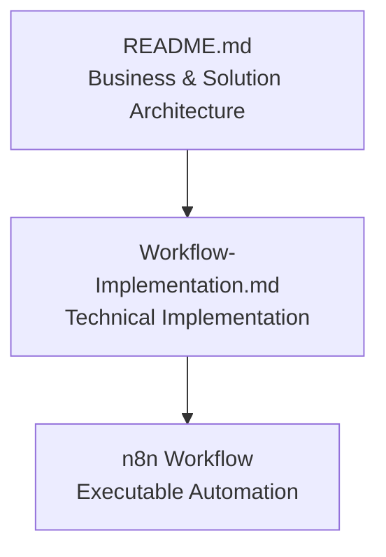

# Workflow Implementation

## Document Information

| Item | Value |
|---|---|
| Platform Version | v2.0 |
| Document Version | v1.8 |
| Status | Active |
| Last Updated | 2026-07-30 |
| Related Documents | README.md, Architecture Diagram |

This document explains how the enterprise architecture described in `README.md` is implemented in n8n. It is a technical companion to the README, not a replacement for it.

**See also:** `README.md` (business and solution architecture) · `architecture/supply_chain_risk_platform_architecture_v2.svg` (visual diagram)

---

## 1. Purpose

`README.md` explains this platform from a business and architectural perspective: what problem it solves, how responsibilities are separated, and why it is designed the way it is.

This document explains how that design is actually built. It maps business functions to real n8n nodes, states which implementation details are confirmed versus unconfirmed, and explains a small number of places where the running workflow differs from the conceptual diagram.

**Intended audience:** engineers and architects who need to modify the workflow, technical interviewers evaluating implementation depth, and future maintainers of this repository.

### Scope

This document does not repeat the README's business rationale, Business Risk Score formula, Tech Stack justification, or Future Roadmap — those live in `README.md`. It is also not a line-by-line code reference: where a node's internal logic has not been directly inspected, that is stated rather than described. See Section 4 for what has and has not been confirmed.

---

## 2. Relationship Between Documents

Each document in this repository uses a different level of abstraction. Reading them in this order gives a full picture of the platform, from business intent to executable automation:

If a statement in this document appears to contradict the README, the README describes intent and this document describes what is currently built. Section 5 explains the specific places where the two differ, and why.

This diagram shows document-to-document flow. For how the README's four architecture layers map onto the sections below, see [Section 10, Layer Traceability](#10-layer-traceability).

---

## 3. Implementation Overview

The workflow is built as two independent n8n workflows that share one Google Sheets backend: the **Critical Alert Workflow** and the **Operational Summary Workflow**. Both are described at a business level in the README.

Three implementation choices shape how business functions map to nodes:

- **A single Code node can implement more than one business function.** For example, supplier matching and news cleaning are implemented in one node, not two.
- **Node count is optimized for maintainability, not for a one-node-per-business-function mapping.** Splitting every business function into its own node would make the workflow easier to describe, but harder to operate.
- **The workflow structure does not always mirror the business-level diagram.** The README's three-way notification split (Critical / Summary / Log Only) is implemented differently from how it is drawn. Section 5 explains why.

---

## 4. Architecture Mapping

This table maps each business function from the README to its actual n8n implementation. Both tables below are based on direct node code and parameters from the sanitized workflow JSON exports (two earlier "Operational Summary Workflow" exports turned out to be duplicates of the Critical Alert Workflow — a correctly exported file was provided in a later review; see [Section 12](#12-lessons-learned)).

### Critical Alert Workflow

| Business Function | n8n Node | Purpose | Status | Notes |
|---|---|---|---|---|
| Scheduled trigger | `Critical Alert Scheduler` | Starts the workflow every 6 hours (demo) | Confirmed | — |
| RSS News Feed | `Fetch Supply Chain News` | Retrieves supply chain news from Google News | Confirmed | HTTP Request node (not a dedicated RSS node) calling `https://news.google.com/rss/search?q=...&when:2d...`. The `when:2d` query parameter asks Google News to return only the last ~2 days of results, ahead of the explicit 48-hour check described below |
| Supplier Keyword Matching + News Cleaning | `Match Supplier And Clean News` | Matches articles to the supplier master and normalizes article data | Confirmed | Implemented as one combined Code node, not two. The response from `Fetch Supply Chain News` is raw RSS/XML text, parsed with regular expressions (no dedicated XML parser). Matching uses a hardcoded 5-supplier keyword list; articles that mention no supplier but do match generic supply-chain terms (for example, "port", "shortage") default to `ChipTech Global` rather than being discarded. Results are capped at 50 items per run |
| Age Filter | `Match Supplier And Clean News` | Excludes articles older than 48 hours | Confirmed | Implemented in JavaScript inside this node: each item's `pubDate` is converted to `hoursOld`, and the item is skipped (`continue`) if `hoursOld > 48`. Verified by direct code inspection |
| Load existing events for deduplication | `Load Risk Events Sheet` | Reads existing Google Sheets records | Confirmed | Positioned before the AI step; feeds directly into `Prepare AI Risk Prompt` |
| URL-based deduplication | `Prepare AI Risk Prompt` | Compares incoming source URLs against existing records | Confirmed | Despite its name, this node's confirmed code performs deduplication only: it builds a list of existing `source_url` values from `Load Risk Events Sheet`, then filters the matched articles from `Match Supplier And Clean News` down to those whose URL is not already in that list |
| AI prompt definition | `Generate AI Risk Assessment` | Defines the system and user prompt sent to GPT-4o-mini | Confirmed | The prompt template lives in this node's own configuration, not in `Prepare AI Risk Prompt`. System message requires strict JSON output with 8 fields; user message is `Supplier: {{ supplier_name }} / Text: {{ raw_text }}`. No Tools sub-node is actually connected, despite the connector being visible in the editor |
| AI Risk Analysis | `Generate AI Risk Assessment` | Calls GPT-4o-mini to score the event | Confirmed | Model confirmed as `gpt-4o-mini` |
| Parse AI output | `Parse AI Risk Output` | Converts the AI's response into structured fields | Confirmed | Kept separate from the AI call itself. Also includes a fallback for malformed AI responses — see [Section 7](#7-data-quality-controls) |
| Category Standardization | `Parse AI Risk Output` | Maps AI output to one of 9 defined categories | Confirmed | `standardizeCategory()` matches keywords in the AI's free-text category (for example, "shortage", "material" → Supply Shortage) against the 9 standard categories, defaulting to `Other` when nothing matches |
| Business Risk Score calculation | `Parse AI Risk Output` | Computes the weighted score from AI-provided severity, impact, and urgency | Confirmed | `overall_risk_score = severity × 0.40 + impact × 0.35 + urgency × 0.25`, computed in the same node as category standardization, matching the formula in the README |
| Alert level classification | `Parse AI Risk Output` | Classifies each event as critical, summary, or low based on score | Confirmed | Stored as `alert_level` on the row before it reaches Google Sheets. This is a data classification, not a routing action — see [ADR-004](#5-design-decisions) |
| Google Sheets Storage (all events) | `Save Risk Event To Sheet` | Appends every processed event to Google Sheets | Confirmed | Runs before the risk threshold check — this is why every event is stored regardless of score. Sheet is named `risk_events`. Confirmed fields include supplier identity, source URL, AI-derived scores, `overall_risk_score`, `alert_level`, category, and status-tracking fields (`critical_alert_status`, `summary_status`) |
| Notification Routing | `Check Critical Risk Threshold` | Splits execution into two branches | Confirmed | Two-way (true/false), evaluating `overall_risk_score >= 4.5` directly — not `alert_level`. Not the three-way split shown in the architecture diagram — see [ADR-004](#5-design-decisions) |
| Critical Alert email | `Send Critical Alert Email` → `Prepare Critical Alert Update` → `Update Critical Alert Status` | Sends the immediate alert and records delivery status | Confirmed | True branch of the threshold check |
| SQL persistence (planned) | `Send Risk Event To SQL API` | Would post the event to a SQL-backed API | Confirmed, Deactivated | False branch of the threshold check. The prepared request body omits `overall_risk_score` and `alert_level` — if activated as currently configured, a SQL consumer would not receive the computed score or classification |

### Operational Summary Workflow

**Evidence note:** a correctly exported, distinct JSON for this workflow was provided and reviewed. The rows below are based on direct node code and parameters, not screenshots.

| Business Function | n8n Node | Purpose | Status | Notes |
|---|---|---|---|---|
| Scheduled trigger | `Schedule Trigger` | Runs at 5:00 AM and 2:00 PM CST | Confirmed | Two schedule entries confirmed on the trigger node |
| Read all events | `Get Summary Events From Sheet` | Reads rows from the shared Google Sheet | Confirmed | Plain read with no filter options configured on the node itself — all filtering happens downstream, in `Prepare Summary Events` |
| Summary event filtering | `Prepare Summary Events` | Selects which events belong in this summary run | Confirmed | Three confirmed conditions, all required: `alert_level === 'summary'`, `summary_status === 'pending'`, and `event_date` within the last 72 hours (source code comment: "本番用：直近72時間のみ" — "production: most recent 72 hours only"). This resolves the filter question left open in earlier reviews |
| AI prompt definition | `Prepare Summary Events` | Builds the prompt sent to GPT-4.1-mini | Confirmed | Unlike the Critical Alert Workflow, the full prompt — instructions plus the JSON-serialized event list — is assembled as a template string in this Code node and passed forward as `prompt_text`. The AI node itself carries no system message, only `{{ $json.prompt_text }}`. The prompt explicitly instructs the model to use only the supplied data and never invent suppliers, risks, scores, or URLs |
| Executive summary generation | `Generate AI Executive Summary` | Calls GPT-4.1-mini to write the summary | Confirmed | Model confirmed as `gpt-4.1-mini`. No Tools sub-node is connected, consistent with the Critical Alert Workflow |
| Email formatting | `Build HTML Email` | Combines the AI-written summary with a fixed source-events table | Confirmed | Appends an HTML table (date, supplier, risk title, category, score, source link) built directly from the filtered event list, below the AI-generated text |
| Send summary | `Send Summary Email` | Sends the Operational Summary email | Confirmed | Subject line confirmed as "📊 Supply Chain Risk Summary \| 5AM Cycle / 2PM Cycle \| Generated at ...". It does not use the word "Daily" anywhere |
| Status update | `Prepare Rows For Update` → `Update Summary Status` | Writes delivery status back to Google Sheets | Confirmed | Matches rows by `row_number`; sets `summary_status: 'sent'` and `summary_sent_at`. Writes to the same Google Sheet (`risk_events`) as the Critical Alert Workflow |

---

## 5. Design Decisions

Each decision below carries an Architecture Decision Record (ADR) identifier. These IDs exist to support a future decision log; they do not change the explanations themselves.

### ADR-001 — Why Age Filter and Category Standardization are not separate nodes

The README describes these as distinct business functions because they are distinct *decisions*, not because each requires its own node. Combining a filtering or mapping rule into an adjacent Code node reduces the total node count and keeps related logic together. **Trade-off:** a reader of the n8n canvas cannot see these steps as individually labeled nodes — they have to be inferred from surrounding node names or confirmed by reading the code. This cost was accepted in exchange for a simpler workflow graph.

Both have since been confirmed by direct code inspection (see Section 4): Age Filter runs inside `Match Supplier And Clean News`, and Category Standardization runs inside `Parse AI Risk Output`.

### ADR-002 — Why Supplier Matching and News Cleaning are combined

Both operations run against the same input (a single article) and produce a single output (a cleaned, matched, or discarded article). There is no intermediate business decision that depends on one step completing before the other starts. Combining them avoids an extra node with no independent decision logic.

### ADR-003 — Why AI output parsing is a separate node

Unlike the two decisions above, `Parse AI Risk Output` is kept separate from `Generate AI Risk Assessment`. AI responses are less predictable than deterministic code, so isolating the parsing step makes it easier to debug when the AI's output format changes, without needing to re-examine the prompt or the AI call itself.

### ADR-004 — Why Notification Routing differs from the conceptual diagram

The README and architecture diagram describe a three-way split: Critical Alert, Operational Summary, and Log Only. The actual implementation has only one explicit branch point — `Check Critical Risk Threshold` — which is a two-way (true/false) split, not three-way.

This works because of the order of operations: **every event is saved to Google Sheets before the threshold check runs.** The three-way outcome described in the README is therefore not implemented as three branches in one workflow. It is the combined result of two independent decisions made at different times:

1. `Check Critical Risk Threshold`, at ingestion time, decides only whether an event is Critical (true) or not (false).
2. The Operational Summary Workflow, on its own schedule, separately reads Google Sheets and selects events in the 3.5–4.49 range.

An event that is neither Critical nor selected by the Operational Summary Workflow is never explicitly routed to "Log Only." It simply remains in Google Sheets, already stored, and is never picked up by either notification path. **Log Only is an absence of further action, not a routing action.** This is a meaningful difference from the diagram, which shows it as an explicit third branch, and is worth knowing before modifying either workflow.

Code inspection of `Parse AI Risk Output` has since confirmed that the three-way classification does exist as data: every event is tagged with an `alert_level` of `critical`, `summary`, or `low` before it is saved. This refines, but does not reverse, the point above — the classification is computed once, but the two notification paths still act on it independently and at different times. `Check Critical Risk Threshold` has been confirmed to re-evaluate `overall_risk_score >= 4.5` directly, rather than reading the `alert_level` field it could have used instead.

### ADR-005 — Why Google Sheets is used

Google Sheets requires no infrastructure setup, is easy to inspect manually, and is sufficient for demo-scale audit logging. It is not a production-grade database. This is already stated in the README's Tech Stack section and is not repeated in depth here.

### ADR-006 — Why SQL integration is currently disabled

`Send Risk Event To SQL API` exists on the canvas and is connected to the false branch of the threshold check, but it is deactivated. This shows that SQL integration work has started at the workflow level, ahead of the SQL Server schema and backend described in the README's roadmap. Activating this node without a working SQL endpoint would cause every non-critical event to fail on that branch, so it remains off until the backend is ready.

---

## 6. Demo vs Production

The README's Demo vs Production table covers business-facing aspects (scheduling, storage, suppliers, notifications, analytics). This table covers operational aspects not addressed there.

| Aspect | Current (Demo) | Production Recommendation |
|---|---|---|
| Authentication | n8n-managed credentials (Google, OpenAI, Gmail) | Enterprise identity provider (for example, OAuth via corporate SSO), with credentials rotated and scoped per environment |
| Monitoring | None observed on the canvas | Workflow-level execution monitoring and alerting on failure |
| Logging | Implicit, via n8n's execution history and the Google Sheets audit trail | Centralized, structured logging with retention policy |
| Error handling / retry | Confirmed absent at the node-configuration level (Critical Alert Workflow); `Parse AI Risk Output` does catch malformed AI responses in code — see Section 7 | Explicit retry logic on external calls (RSS fetch, AI calls, email delivery), with defined failure behavior |
| Configuration | Thresholds and scheduling appear to be set directly in node parameters | Externalized configuration (for example, a settings sheet or environment variables), so thresholds can change without editing workflow logic |

Where a row states "not observed," this means the workflow screenshots reviewed did not show evidence of that capability — not that it has been confirmed absent.

---

## 7. Data Quality Controls

| Control | Status | Notes |
|---|---|---|
| Age filtering | Confirmed | Verified by code inspection: `Match Supplier And Clean News` skips items where `hoursOld > 48` — see [Section 4](#4-architecture-mapping) |
| Duplicate detection | Confirmed | `Prepare AI Risk Prompt` filters matched articles against existing `source_url` values loaded from Google Sheets before any article reaches the AI step |
| Status tracking | Confirmed | Both workflows write delivery status back to Google Sheets after sending an email. Confirmed fields: `critical_alert_status`, `summary_status` |
| Error handling | Partially Confirmed | `Parse AI Risk Output` catches AI response JSON-parse failures and writes a fallback record flagged for manual review, instead of failing the workflow. No handling confirmed for other failure types (RSS fetch, Sheets writes, email delivery) |
| Retry strategy | Confirmed Absent | No node in the sanitized Critical Alert Workflow export sets `retryOnFail` or `onError`; the workflow relies on default n8n behavior. Listed as a Production Readiness item in the README's Future Roadmap |
| Validation | Confirmed | `Parse AI Risk Output` validates that the AI response is parseable JSON; unparseable responses fall back to a flagged record (`risk_title: 'Parse error - manual review needed'`) rather than a workflow failure. Field-level validation (for example, score ranges) was not observed. Separately, the Operational Summary prompt instructs the model to use only supplied data and never invent suppliers, risks, scores, or URLs — a prompt-level guardrail, not code-level validation of the output |
| Audit logging | Confirmed | Every event is written to Google Sheets before any notification decision is made |

---

## 8. Human-in-the-Loop

No node in either workflow takes an autonomous business action beyond sending an email, writing to Google Sheets, or updating a status field. The AI nodes (`Generate AI Risk Assessment`, `Generate AI Executive Summary`) produce text output that is parsed and stored or emailed — they do not trigger any downstream action beyond the notification and storage steps already described. This is consistent with the README's statement that AI assists and people decide.

---

## 9. Implementation Notes

- Google Sheets was chosen for transparency and ease of manual inspection during development, not for production-scale performance.
- The SQL API node is prepared but intentionally inactive, ahead of a working SQL backend.
- The Operational Dashboard (Responsive Web) and the planned Executive Dashboard (Power BI) are both separate, static/independent consumers of the Google Sheets data — neither is part of either n8n workflow, and neither is built on top of the other. See README "Dashboard Roles" and Section 10.
- This document is based on direct inspection of the sanitized JSON exports for both workflows. Business logic, node parameters, selected Code node implementations, and prompt construction were verified directly. Where implementation could not be confirmed, that limitation is stated explicitly, mainly in [Section 14](#14-known-documentation-gaps).

---

## 10. Layer Traceability

The README defines four architecture layers: Business Experience, Workflow Automation, AI Intelligence, and Data. The table below traces each layer to where it is documented in this file and where it runs in n8n, so a change in one place can be checked against the others.

| README Layer | Documented In | Implemented By |
|---|---|---|
| Business Experience Layer | Section 4 (email rows), Section 8, README "Dashboard Roles" | `Send Critical Alert Email`, `Send Summary Email`, Operational Dashboard — Responsive Web (`dashboard/`), and planned Executive Dashboard (Power BI) |
| Workflow Automation Layer | Section 3, Section 4 (routing and scheduling rows), Section 5 | Both workflows' scheduler, matching, prompt, and routing nodes |
| AI Intelligence Layer | Section 4 (AI rows), Section 8 | `Generate AI Risk Assessment`, `Generate AI Executive Summary` |
| Data Layer | Section 4 (Sheets rows), Section 7 | `Load Risk Events Sheet`, `Save Risk Event To Sheet`, `Get Summary Events From Sheet`, both `Update *Status` nodes |

A reader who only sees the n8n canvas will understand *what* runs, but not *why* it was built that way — that context lives in this document and in the README.

The Operational Dashboard (Responsive Web) and the planned Executive Dashboard (Power BI) are complementary, not sequential — the same relationship applies between them and the two email channels (Critical Alert, Operational Summary). All four read from the shared operational data layer independently; none is downstream of another. The Operational Dashboard supports event-level monitoring and AI-assisted human review; the Executive Dashboard supports aggregated analytics, trends, and executive reporting. This also protects the audit-log guarantee: an event with `alert_level: low` never triggers a notification, but it is still visible on both dashboards, since both read Google Sheets directly rather than reading whatever the notification step happened to send.

---

## 11. Change Impact Matrix

When one of these components changes, review the listed sections before publishing the change.

| Changed Component | Review |
|---|---|
| AI Prompt Definition (`Generate AI Risk Assessment`, `Prepare Summary Events`) | Section 4, Section 7 |
| Category Keyword Mapping (`standardizeCategory` in `Parse AI Risk Output`) | Section 4, ADR-001 |
| Threshold Logic (`Check Critical Risk Threshold`) | README, Section 4, ADR-004 |
| SQL API (`Send Risk Event To SQL API`) | ADR-006, Section 6, Section 16 |
| Notification Logic | ADR-004 |
| Google Sheets Schema | Section 4, Section 7 |

---

## 12. Lessons Learned

Writing this document surfaced a concrete gap between the architecture diagram and the running workflow: the three-way notification split shown in the diagram is implemented as one two-way branch plus a separately scheduled workflow, not as three branches in one place. This was only caught by comparing the diagram directly against workflow screenshots, which is the same process a new engineer would have to go through before making a safe change to this workflow.

The broader lesson: an architecture diagram optimized for business communication will simplify implementation detail, and that simplification needs to be documented explicitly — not left for a maintainer to rediscover by reading code. That is the reason this document exists as a separate artifact from the README, rather than as an appendix to it.

A second lesson came from the evidence-gathering process itself: a file named `Operational Summary Workflow` was byte-identical to the Critical Alert Workflow export on three separate export attempts before a correct one arrived. Nothing about the filename or file size made this obvious at a glance — it only surfaced by diffing the file against the other export and checking the `name` field inside the JSON. The practical takeaway: verify a workflow export's identity from its content, not its filename, before treating it as evidence.

---

## 13. Future Improvements

- Add `overall_risk_score` and `alert_level` to the `Send Risk Event To SQL API` request body before activating SQL persistence; the current prepared payload omits both.
- Consider adding an explicit routing step that makes the Critical / Summary / Log Only outcome visible as one decision point, rather than the result of two independently scheduled workflows.
- Add error handling and retry logic to external calls (RSS fetch, Sheets writes, email delivery) — `Parse AI Risk Output` already handles malformed AI responses, but this pattern has not been extended elsewhere.
- Activate SQL persistence once the backend described in the README's roadmap is available.

---

## 14. Known Documentation Gaps

This section lists confirmed gaps in current documentation, not planned features.

- The SQL API schema and endpoint contract for `Send Risk Event To SQL API` are documented only as far as the request body confirmed in the Critical Alert Workflow export (see Section 4); no receiving-side schema exists yet.
- Environment variable and credential configuration mapping is not documented.
- The Gamma presentation slides (3, 5, 8) still state a 24-hour Critical Alert age filter and use "Daily Summary" naming. These are superseded by the confirmed 48-hour filter and the "Operational Summary" rename already applied to `README.md` and this document, but the slides have not yet been updated.

---

## 15. References

- `README.md` — business and solution architecture
- Enterprise Architecture Diagram — `architecture/supply_chain_risk_platform_architecture_v2.svg`
- n8n Workflow — Critical Alert Workflow and Operational Summary Workflow (both sanitized exports reviewed)
- Dashboard Prototype — `dashboard/`
- Gamma Presentation — `docs/gamma/`

---

## 16. Document Governance

| Item | Description |
|---|---|
| Document Owner | Repository maintainer |
| Status | Active |
| Review Frequency | When architecture changes |
| Update Trigger | Any node added, removed, renamed, or rewired in either n8n workflow; any change to the README's architecture layers or notification thresholds |
| Related Documents | README.md, Architecture Diagram |
| Relationship to README | This document depends on the README's business and layer model. If that model changes, Section 10 (Layer Traceability) must be re-checked |
| Relationship to Future SQL Implementation | Once `Send Risk Event To SQL API` is activated, Sections 4, 6, and 16 must be updated to reflect the active node and its production configuration |
